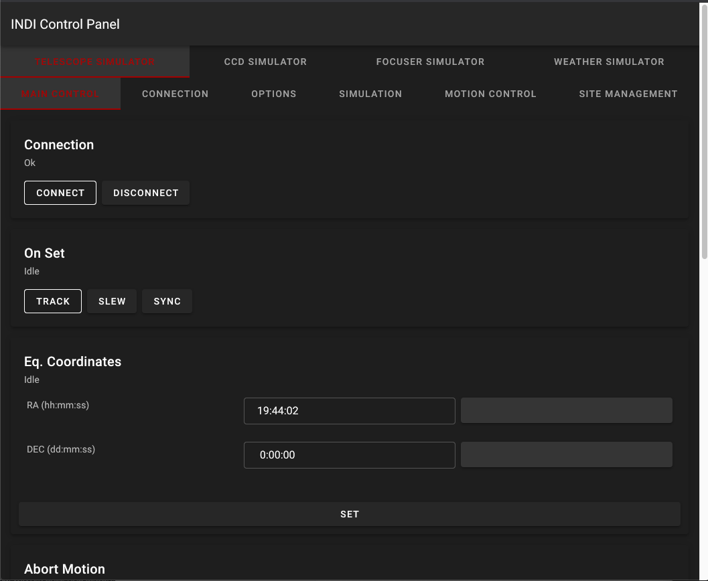

# indi-web

A simple web based INDI control panel.



## Running

```bash
git clone https://github.com/rickbassham/indi-web.git
cd indi-web
docker build -t indi-web:latest .
docker run \
    -e INDI_HOST=host.docker.internal \
    -e INDI_PORT=7624 \
    -p 8081:8081 \
    -it indi-web:latest
```

Now browse to http://localhost:8081

## Docker

This is also published to Docker Hub.

https://hub.docker.com/r/rickbassham/indi-web


